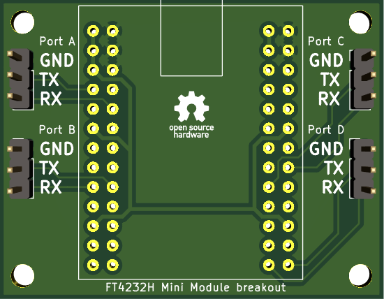

The FTDI FT4232H mini module is a breakout board for the FT4232H chip, which
provides four UART ports via a single USB connection. Unfortunately the board
is unpleasant to use, requiring tons of interconnects to be made between the
pins. The pins themselves are unmarked.

This Kicad project is for a breakout board to the mini module, which makes
it easier to use.

